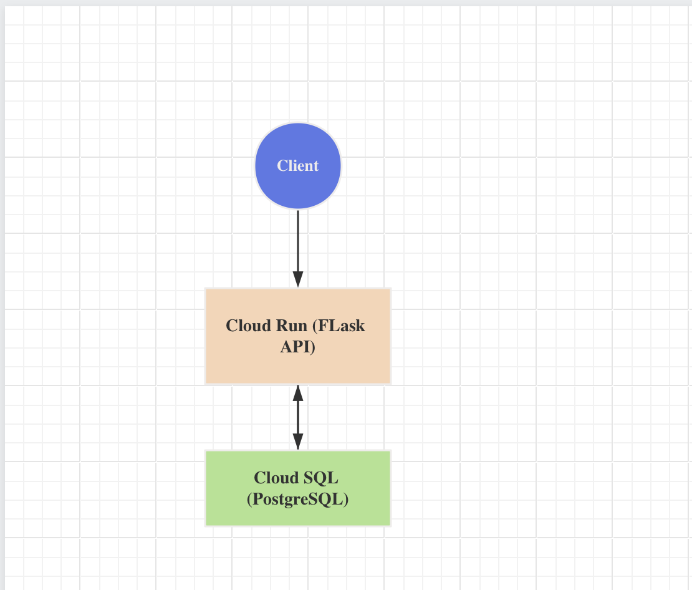
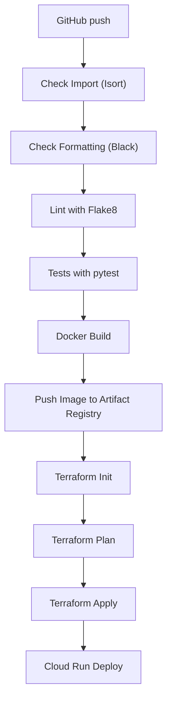

# Cloud Task & Audit Platform
## 1. System Overview
### Purpose

A secure, cloud-native backend platform that:
- Accept task submissions via REST API.
- Processes tasks asynchronously.
- Stores task state and audit logs
- Enforces least-privilege access
- Fully automated via CI/CD and IaC
## 2. Functional Requirements:
### Core Features
1. Create a task
2. Track task status
3. Process tasks asynchronously
4. Store audit logs for every action
5. Secure access to infrastructure and secrets

### Example Use Case:
* A user submits a task
* Task is stored in DB
* Worker picks it up
* Status changes are logged
* All actions are auditable

## 3. Non-Functional Requirements
* Scalability by Serverless (Cluod Run).
* Security by IAM & Secret Manager.
* Reliability via Managed DB + retries
* Observability via Cloud Logging
* Automation via Terraform & github actions.
* Environment isolation via dev, prod.

## 4. High Level Architecture

### Supporting Services
* Artifactory Registry for container images.
* Secret Manager for Credentials.
* IAM for access control.
* GitHub Actions for cicd.
* Terraform for Infrastructure.

## 5. Component Responsibilites
### API Service (Cloud Run)
* Validate requests
* Create tasks
* Read task status
* Write audit logs
* Authenticate requests (API key or JWT)
### Worker Service (Cloud Run)
* Poll pending tasks
* Execute processing logic
* Update task state
* Log execution results

### Database (Cloud SQL - PostgreSQL)
Stores:
1. Tasks
2. audit_logs
3. users (optional)

## 6. Data Model
### tasks
| Field     | Type       | Purpose
| --------- | -------    |---------
| id        |   uuid     |PK
| status    |   enum     |pending/running/done/failed
| payload   |   jsonb    | task data
| created_at|   timestamp| creation time
| updated_at|   timestamp| last update

### audit_logs
| Field     | Type       | Purpose
| --------- | -------    |---------
| id        |   uuid     |PK
| action    |   text     |such as create task
| actor     |   text     | task data
| task_id.  |   uuid.    | creation time
| timestamp |   timestamp| event time

## 7. Security & IAM Design
### Service Accounts
* API component has Service Account.
* CICD has github service account.

### Permission (Least Privilege)
* API and Worker:
    * Cloud SQL Client.
    * Secret Manager Secret Accessor.
* CI/CD:
    * Artifact Registry Writer.
    * Terraform permissions.

## 8. Secret Management Strategy
### Secrets
* DB password.

### Rules
* No secrets in code.
* No secrets in Github.
* Injected at runtime via Secret Manager.

## 9. CI/CD Design

## 10. Terraform Design
Terraform is responsible for:
* Artifact Registry.
* Cloud SQL.
* Secrets.
* IAM.
* Cloud Run Services.
* Networking (VPC).
